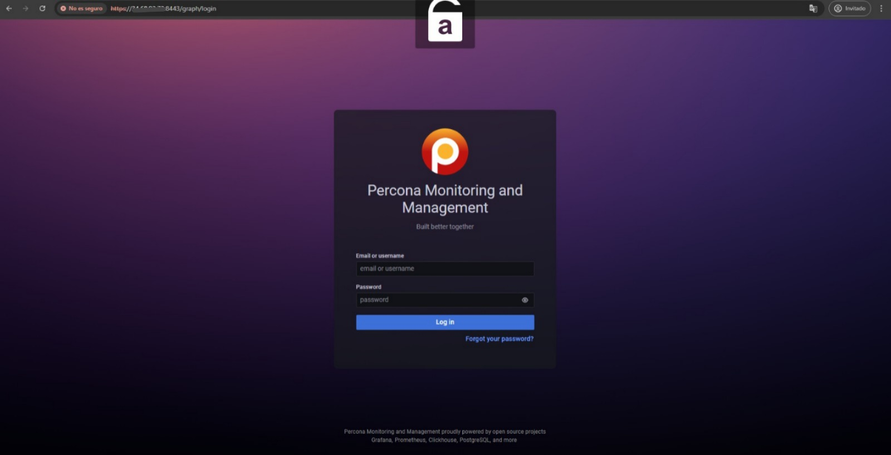
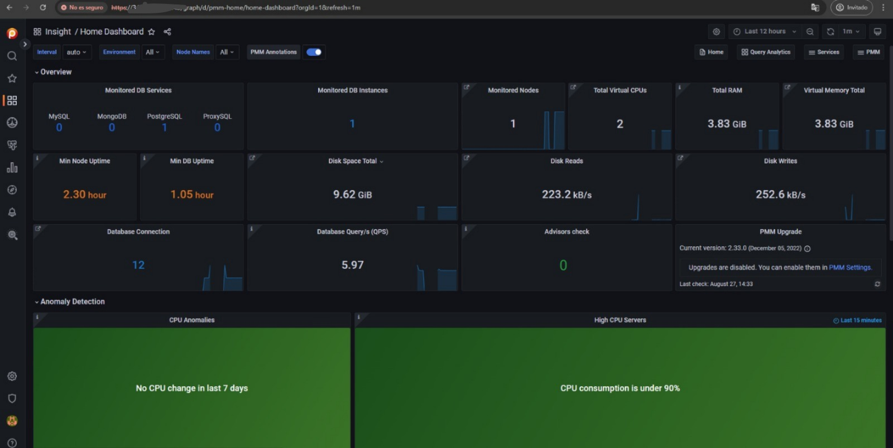

# Ansible Project Template for Percona Monitoring Installation 

This is a template for an Ansible project. It provides a basic structure and guidelines for organizing your Ansible playbooks, roles, and inventory.

## Getting Started 

To get started with this project template, follow these steps:

1. Clone this repository to your  `master-node` machine.
2. Install Ansible on your system if you haven't already.
3. Customize the `inventory` file with your target hosts.
4. Create your playbooks and roles inside the `playbooks` and `roles` directories, respectively.
5. Configure SSH access keys on the node server and preferably a user that has root permissions, in this project I consider the user `test_ansible`
6. In `inventory/dev` file change set the public IP address and ansible_user of the `node-server`
7. Replace `/path/to/your/private/key` with the actual path to the private key file that Ansible will use to connect to the `node-server`.
8. Run your playbooks using the `ansible-playbook` command.
9. Enable TCP port 8443 on the firewall of the node server to visualize the Percona panel.
10. View Percona  web in `https://<IP_PUBLIC>:8443/graph/login`

## Directory Structure

The directory structure of this project template is as follows:

```
├── README.md
├── ansible.cfg
├── group_vars
│   ├── all.yml
│   └── server_percona.yml
├── host_vars
│   └── host_server.yml
├── inventory
│   └── dev
├── playbooks
│   └── server_percona.yml
└── roles
    └── server_percona
        ├── README.md
        ├── defaults
        │   └── main.yml
        ├── files
        ├── handlers
        │   └── main.yml
        ├── meta
        │   └── main.yml
        │   │   :
        │   │   .
```

# Project Setup Instructions

### Set Your Own Environment Variables

As a recommendation, it is necessary to have a user on the server node that has root privileges.

- Connect to the server as a user with sudo privileges.
- Use sudo visudo to securely edit the /etc/sudoers file.
- Add the line for `<test_ansible>` user to allow running specific commands without a password.
- Save and verify the configuration by running a test command.

Before running the playbook, make sure to set up the following environment variables to configure the Percona Monitoring and Management (PMM) panel:

- In the host_vars/server_percona.yml directory, replace `PMM_PUBLIC_PORT` with your desired values. Before that we have to decrypt the file. 

If you want to set your own credentials in a different file, follow these steps..Create  un vault file in `host_vars/<file_name.yml>`, You will be asked to enter a password for the file.
```bash
ansible-vault create ./host_vars/<file_name.yml>
```

```bash
PMM_PUBLIC_PORT: 8443
```
Use this command to decrypt the file

```bash
ansible-vault decrypt ./host_vars/server_percona.yml
```
Use this command to encrypt the file
```bash
ansible-vault encrypt ./host_vars/server_percona.yml
```

It is important to have referenced the variables that will be used in each playbook, in this case in `playbooks/server_percona.yml` 


```bash 
---
- name: Configure Server Percona
  hosts: server_percona
  become: yes
  vars_files:
    - ../host_vars/server_percona.yml
  roles:
    - server_percona
```
Specify the `inventory , remote_user, roles_path, private_key_file` paths.

```bash
[defaults]
inventory = ./inventory/dev
remote_user = test_ansible
roles_path = ./roles
private_key_file = ~/.ssh/server_percona
host_key_checking = False
retry_files_enabled = False
timeout = 30

[privilege_escalation]
become = False
become_method = sudo
become_user = root
become_ask_pass = False
```


##### Run the Ansible Playbook
```
ansible-playbook -i inventory/dev ./playbooks/server_percona.yml --ask-vault-pass -v
```


## Default Credentials

When starting Percona Monitoring and Management (PMM) using Podman, the default credentials are:

- **Username**: `admin`
- **Password**: `admin`






## Contributing

If you would like to contribute to this project template, please follow these guidelines:

- Fork this repository.
- Create a new branch for your changes.
- Make your changes and commit them.
- Push your changes to your forked repository.
- Submit a pull request.


## License

This project is licensed under the MIT License. See the [LICENSE](LICENSE) file for more information.


## References 

- [Ansible Vault ](https://docs.ansible.com/ansible/2.8/user_guide/vault.html)
- [Percona Documentation](https://docs.percona.com/)

## Troubleshooting
- [Stack Overflow](https://stackoverflow.com/questions/25582740/missing-sudo-password-in-ansible)